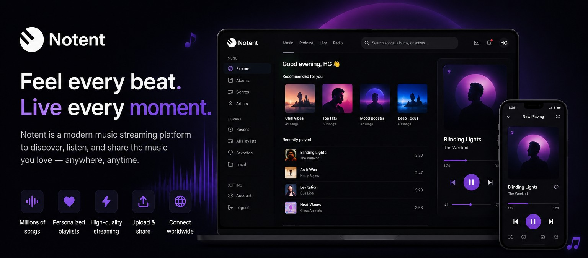

<div align="center">



# 🎵 Notent

### Stream music. Discover artists. Feel every moment.

A modern full-stack music streaming platform built with **Next.js**, **NestJS**, and **TypeScript**.

<br />

[]()
[]()
[]()
[]()

</div>

---

## ✨ About Notent

**Notent** is a modern full-stack music streaming platform designed for discovering, listening to, and enjoying music.

The application provides a clean and responsive interface for exploring songs, albums, artists, genres, and playlists. Users can manage their music library, save favorite tracks, upload music, and interact with the platform through a modern authentication system.

The project consists of two main applications:

- 🎨 **Client** — Next.js frontend
- ⚙️ **Server** — NestJS backend

---

## 🚀 Features

### 🎧 Music Experience

- Explore music
- Browse albums
- Discover artists
- Browse genres
- Listen to tracks
- Music player with playback controls
- Search for songs, albums, and artists
- Recently played tracks

### 📚 Music Library

- Recently played music
- Personal playlists
- Favorite tracks
- Local music
- Album collections

### ❤️ Personalization

- Add songs to favorites
- Create and manage playlists
- Personalized music library
- Track listening activity

### 👤 Authentication

- User registration
- User login
- JWT authentication
- Google authentication
- Facebook authentication
- Account management

### ☁️ Music Management

- Upload tracks
- Upload and manage media
- Cloudinary integration
- Music search
- Track metadata management

### 🎨 User Interface

- Modern dark interface
- Responsive design
- Desktop and mobile support
- Animated UI elements
- Interactive components
- Notifications and toast messages

---

# 🛠 Tech Stack

## 🎨 Frontend

The client application is built with modern React technologies.

| Technology | Description |
|---|---|
| **Next.js 16** | React framework |
| **React 19** | UI library |
| **TypeScript** | Type-safe JavaScript |
| **Material UI** | UI component library |
| **Headless UI** | Accessible UI components |
| **HeroUI** | UI components and theming |
| **Tailwind CSS** | Utility-first CSS |
| **Sass** | CSS preprocessor |
| **Framer Motion** | Animations |
| **Axios** | HTTP client |
| **Formik** | Form management |
| **Yup** | Form validation |
| **Lucide React** | Icons |
| **React Icons** | Icon library |
| **React Slick** | Sliders and carousels |
| **React Swipeable** | Swipe interactions |
| **React Hot Toast** | Notifications |
| **WaveSurfer.js** | Audio waveform visualization |
| **Next Cloudinary** | Cloudinary integration |

---

## ⚙️ Backend

The server application is built with NestJS.

| Technology | Description |
|---|---|
| **NestJS 10** | Backend framework |
| **TypeScript** | Main programming language |
| **Prisma** | Database ORM |
| **Passport** | Authentication middleware |
| **JWT** | Authentication |
| **Argon2** | Password hashing |
| **bcryptjs** | Password hashing |
| **Redis** | Caching and session storage |
| **ioredis** | Redis client |
| **Express Session** | Session management |
| **Cloudinary** | Media storage |
| **Multer** | File uploads |
| **Class Validator** | Request validation |
| **Class Transformer** | Data transformation |
| **Swagger** | API documentation |
| **Nest Schedule** | Scheduled tasks |
| **Passport Google OAuth** | Google authentication |
| **Passport Facebook** | Facebook authentication |
| **Passport JWT** | JWT authentication |

---

# 🎵 Project Structure

```text
Notent/
│
├── client/
│   │
│   ├── app/                # Next.js application
│   ├── components/         # Reusable UI components
│   ├── public/             # Static files
│   ├── styles/             # Application styles
│   │
│   ├── package.json
│   └── next.config.*
│
├── server/
│   │
│   ├── src/
│   │   ├── modules/        # Application modules
│   │   ├── auth/           # Authentication
│   │   ├── users/          # User functionality
│   │   ├── music/          # Music functionality
│   │   └── main.ts         # Application entry point
│   │
│   ├── prisma/             # Prisma configuration
│   ├── package.json
│   └── nest-cli.json
│
├── assets/
│   └── banner.png          # README banner
│
├── package.json
│
└── README.md